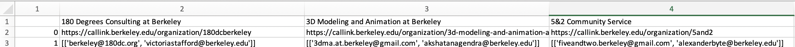

# CalClubScraper
Scrapes all the emails of UC Berkeley's (Cal) student organizations (clubs). Outputs a .csv of the clubs and contact email(s) per club like so:

Powered by [Selenium](https://www.selenium.dev/documentation/) and [BeautifulSoup4](https://www.crummy.com/software/BeautifulSoup/bs4).

---
## Runtime Enviornment
CalClubScraper runs using `pip3` packages. It also requries you to download a `Chromedriver` executable file. You also would need Python 3.6+

---
## Installation Steps 
1. If you have not already, install [`Python 3.6+`](https://www.python.org/downloads/)
2. Install all `pip3` required packages by running `pip3 install requirements.txt` in command line.
3. Install the latest version of `Chromedriver`: https://chromedriver.chromium.org/downloads](https://chromedriver.chromium.org/downloads)
4. Place the `Chromedriver` executable file into the `src/` directory.

---
## Execute
To run the scraper, run `python3 src/webscraper_email.py` from the root directory. Follow the status messages! *It may take a while*

Can change the endpoint URL being scraped. Simply go to https://callink.berkeley.edu/organizations and select an option to filter down clubs you would like to scrape.

---
## Sources
* BeautifulSoup4 documentation: https://www.crummy.com/software/BeautifulSoup/bs4/doc/ 
* Selenium documentation: https://selenium-python.readthedocs.io/ 
* Website scraped: https://callink.berkeley.edu/ 
